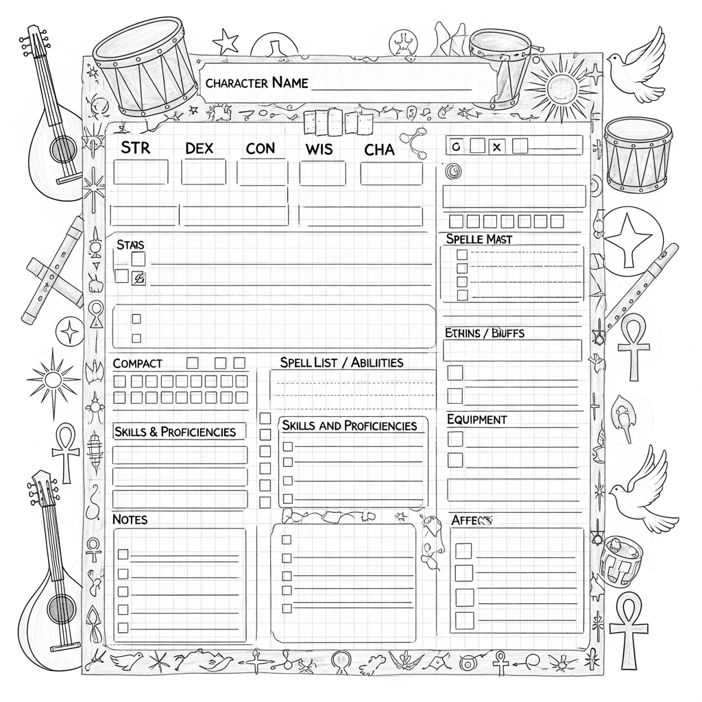
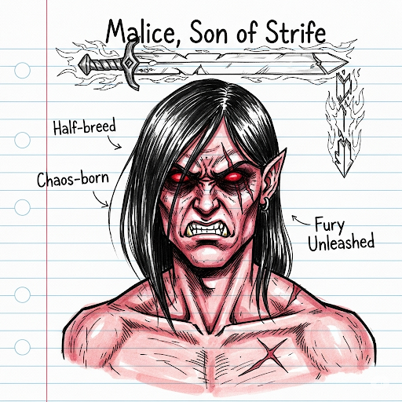
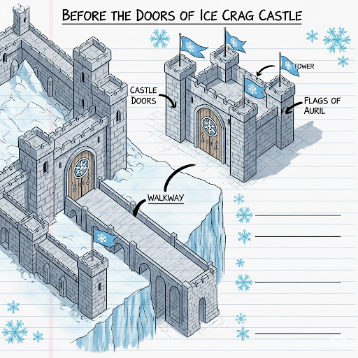
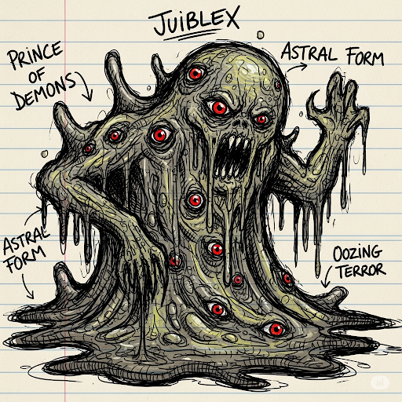
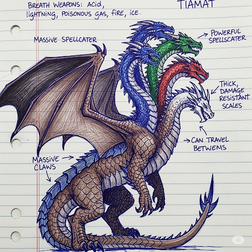
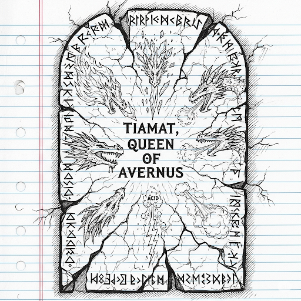

# TorilLIB-Distro
Public Colab for TorilLIB an ai built slick ui for torilmud and Nyzzlib

This is the public TorilLIB repo. The private backend (databases, raw logs, private scripts) lives outside the repo at E:\tools\projects\TorilLIB\private\backend\. Build scripts in scripts/windows/ reference that location via paths.yaml. To produce a release package, run build-distribution.ps1.

# TorilLIB

A modular Mudlet library and AI-assisted pipeline for **TorilMUD**.  
This project combines automated triggers, database-driven content, and AI-generated assets into a cohesive toolkit.

---

## ✨ Features

- **AI Asset Pipeline**  
  - Generates notebook-style **character sheets**, **maps**, **icons**, and **NPC portraits**.  
  - Assets are linked directly to the in-game database (`toril.db` / `quests.sqlite`).  

- **Triggers & Timers**  
  - Prebuilt Mudlet XML packages for auto-combat, hunting, quest handling, and exploration:contentReference[oaicite:0]{index=0}:contentReference[oaicite:1]{index=1}.  

- **Database Integration**  
  - Syncs player, quest, NPC, and item data across both **SQLite** (local) and **MySQL** (server).  
  - Stores AI prompts and generation metadata for reproducibility.  

- **Exploration Mode**  
  - Automatically records rooms, NPCs, and aliases when exploring zones.  
  - Builds out NPC sheets and item data in real-time.  

- **Hunter Mode**  
  - Kill list automation: hunts targets across zones regardless of room.  
  - Timers control post-combat wait, room linger duration, and movement buffering.  

- **Quest Tracking**  
  - Notebook-style quest pages generated from the items/quests DB.  
  - Links quest items to their zones and special icons.  

- **AI Script Helper**  
  - Parses log output and suggests improvements using local AI models.  
  - Generates **help.md** and **help.html** docs automatically.  

---

## 📖 Notebook Assets (Samples)

### Character Sheet

### Demogorgon

### Malice.png

### Icecrag

### Juiblex

### Tiamat

### Tiamat Tablet

To Contribute, send me a message at zenevan@zenevan.com or here
Images
13 minutes ago
tablet.png
