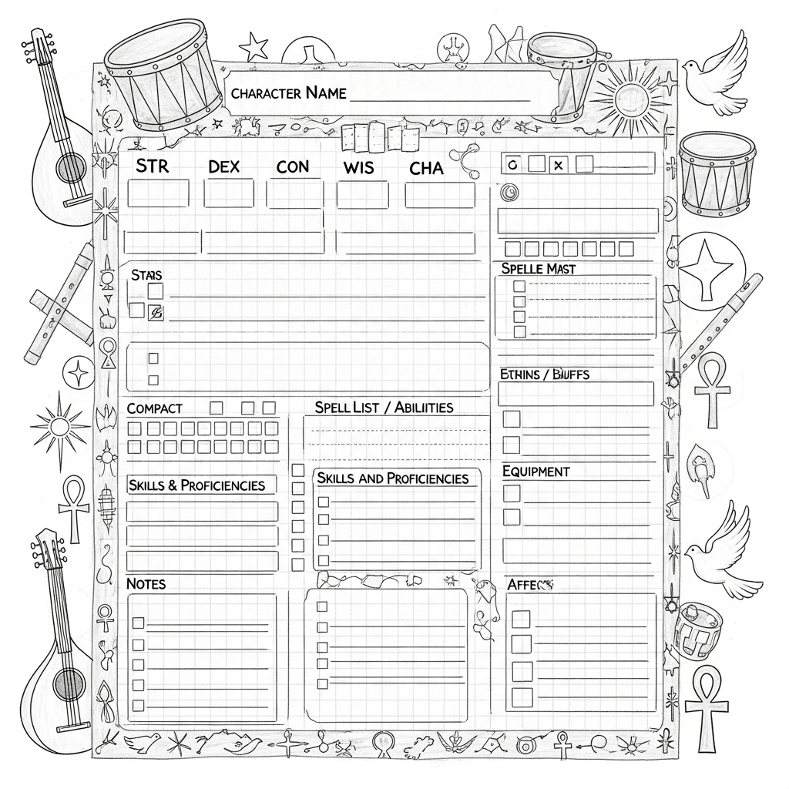
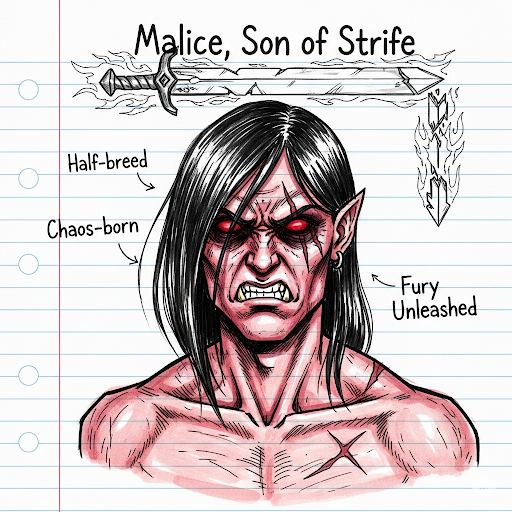
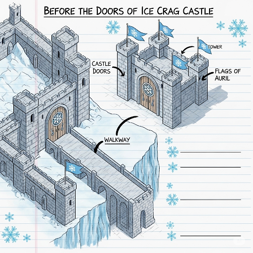
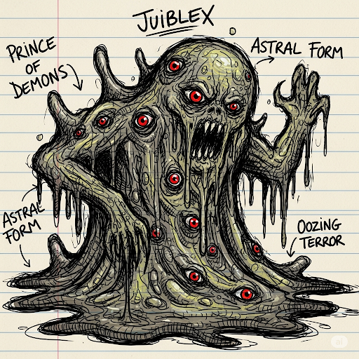
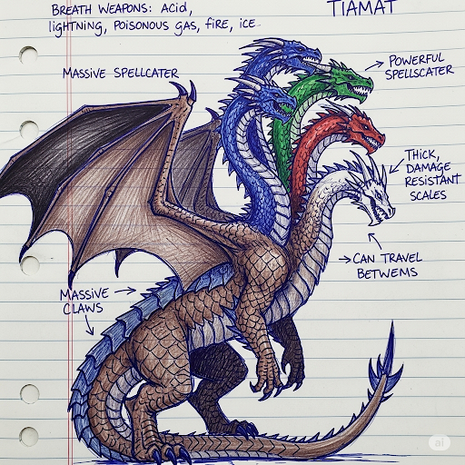
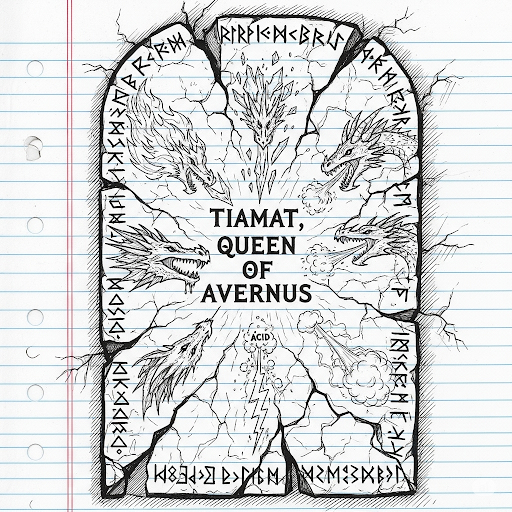

# TorilLIB-Distro
Public Colab for TorilLIB an ai built slick ui for torilmud and Nyzzlib

This is the public TorilLIB repo. The private backend (databases, raw logs, private scripts) lives outside the repo at E:\tools\projects\TorilLIB\private\backend\. Build scripts in scripts/windows/ reference that location via paths.yaml. To produce a release package, run build-distribution.ps1.

# TorilLIB

A modular Mudlet library and AI-assisted pipeline for **TorilMUD**.  
This project combines automated triggers, database-driven content, and AI-generated assets into a cohesive toolkit.

---
Hello, finally able to get privacy and enough security to begin development again, blasting this pc and full reinstall, i have
down to a science. also the new am5 pc will be built by may.

There is a new release of good ai that is local, and am doing full burndown and rebuild.

I still have all the prompts to build the themes with easy add new for your own styles.
Map prompt when last run was at room 12,000 and something, and i am still gathering data
on npc every single zone i attend.

i also have a mudlet integrated scrape of valkeryian blades site and have an in game
editor to build it from scratch. If you feel froggy, install xampp, mysql and a database schema
with python scripts to export and import data, scrape other sites, these scripts automatically
credit author and include easy share using gmail if you want.

Every feature i am creating is modular, meaning, u can turn it off and on with ease, i am 
making all trigger text, regex for torilmud use internal functions instead of a bunch of triggers
we're gonna just do prompt to prompt, role based conditions, a powers import, skills import
that does every character on its own, or it gleans data as you get it, you decide.

I hope this can serve as a nice baseline for young, learning and advanced coders
to not only make it semi educational, because it generated hover for all the web pages anyway
and storage for this is cheap =S

i will try to put the current TorilLib port of Nysslib out as i debug it over the next week.
Here is my first attempt: space for after i blast this stupid computer away.

Enjoy! - Afu Eats Babies
hungry fucking troll from ghore

## ✨ Features

- **AI Asset Pipeline**  
  - Generates notebook-style **character sheets**, **maps**, **icons**, and **NPC portraits**.  
  - Assets are linked directly to the in-game database (`toril.db` / `quests.sqlite`).  

- **Triggers & Timers**  
  - Prebuilt Mudlet XML packages for auto-combat, hunting, quest handling, and exploration:contentReference[oaicite:0]{index=0}:contentReference[oaicite:1]{index=1}.  

- **Database Integration**  
  - Syncs player, quest, NPC, and item data across both **SQLite** (local) and **MySQL** (server).  
  - Stores AI prompts and generation metadata for reproducibility.  

- **Exploration Mode**  
  - Automatically records rooms, NPCs, and aliases when exploring zones.  
  - Builds out NPC sheets and item data in real-time.  

- **Hunter Mode**  
  - Kill list automation: hunts targets across zones regardless of room.  
  - Timers control post-combat wait, room linger duration, and movement buffering.  

- **Quest Tracking**  
  - Notebook-style quest pages generated from the items/quests DB.  
  - Links quest items to their zones and special icons.  

- **AI Script Helper**  
  - Parses log output and suggests improvements using local AI models.  
  - Generates **help.md** and **help.html** docs automatically.  

---

## 📖 Notebook Assets (Samples)

### Character Sheet

### Demogorgon

### Malice.png

### Icecrag

### Juiblex

### Tiamat

### Tiamat Tablet

To Contribute, send me a message at zenevan420@gmail.com or here
Images
13 minutes ago
tablet.png
